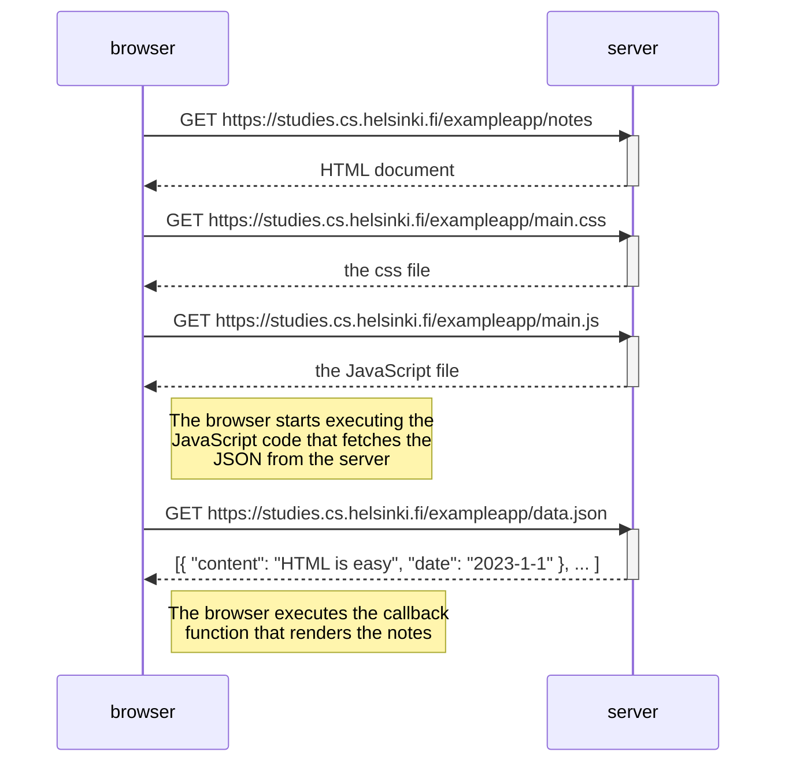
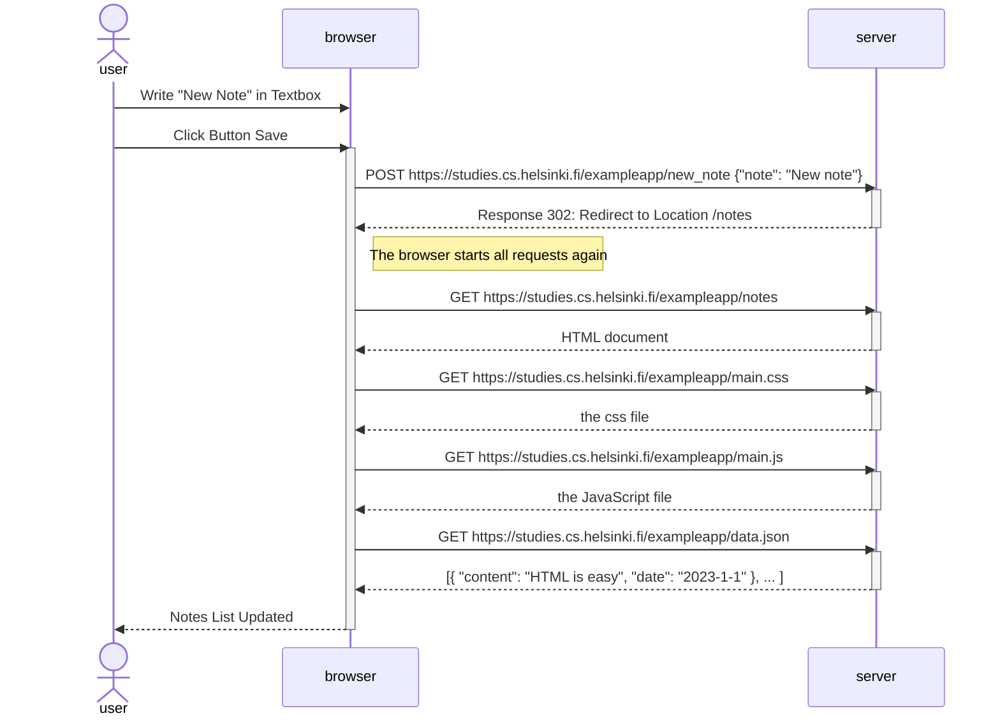
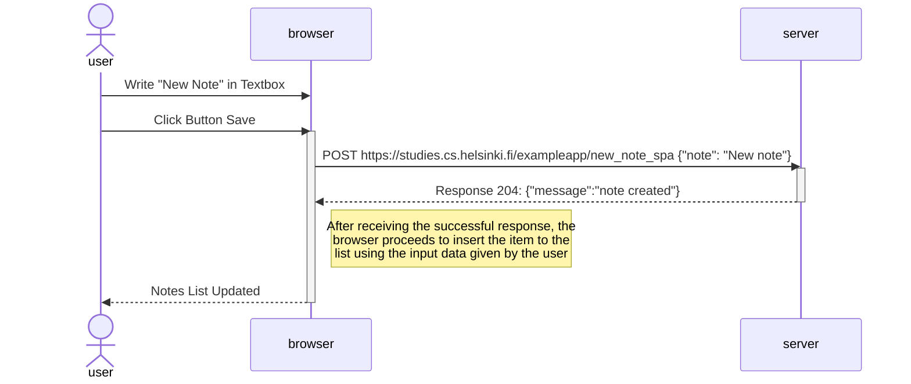

<h1>Traditional Approach</h1>
<h2>Loading Page</h2>

All resources such as HTML, CSS, JavaScript and data are load.

<h2>Post New Note</h2>

In the traditional approach, a POST request involves sending data to the server, which then processes the request and responds by reloading and rendering the entire webpage. This method refreshes the entire page, requiring the browser to reload all resources such as HTML, CSS, and JavaScript, which can result in longer loading times and a less seamless user experience.

 
 

<h1>Single Page Application (SPA)</h1>
<h2>Loading Page</h2>

When loading the webpage for the first time, it must perform the same queries as the traditional approach, retrieving the HTML document and subsequently the CSS, JS script, and JSON data.

<h2>Post New Note</h2>

Since it follows the AJAX approach, it doesn't reload the entire page. Instead, it updates specific parts of the page dynamically, which leads to a faster and smoother user experience compared to the traditional approach where the whole page is re-rendered.

